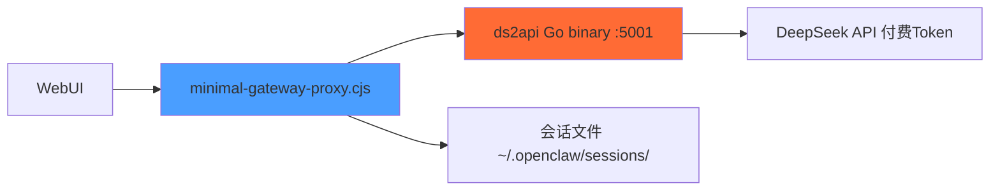
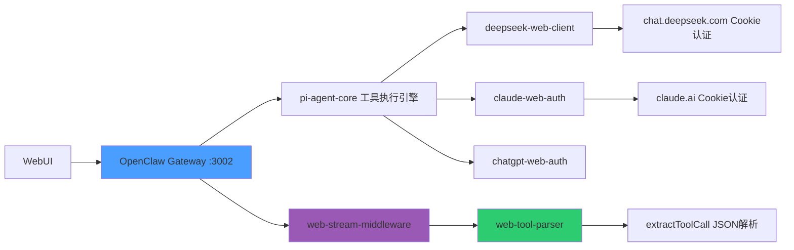

# ds2api vs Zero-Token 方案对比与架构说明

## 概述

该项目包含两套独立的 OpenClaw 运行方案：

| 方案 | 目录 | 端口 | 内存 | 认证方式 | 模型来源 |
|------|------|------|------|----------|----------|
| **ds2api（极简代理）** | `/home/luoshenye/桌面/openclaw-main` | 3001 | ~60 MB | 固定 Token | DeepSeek 官方 API (ds2api Go binary) |
| **Zero-Token（完整网关）** | `/home/luoshenye/桌面/op new/openclaw-zero-token-main` | 3002 | ~100 MB | 浏览器 Cookie | 11个Web平台免Token |

---

## 技术架构差异

### ds2api 方案（极简代理）



**特征**：
- 单文件 ~2200 行，无任何依赖
- 仅支持 DeepSeek 官方 API（需付费 Token）
- 工具调用通过 OpenAI function calling（原生支持）
- ToolCall/ToolResult 格式为标准 OpenAI JSON
- 无 Chrome/Playwright 依赖

### Zero-Token 方案（完整OpenClaw网关）



**特征**：
- 完整 OpenClaw Fork，数千文件
- 11个Web平台免Token（通过浏览器Cookie认证）
- 工具调用通过提示词注入（Prompt Injection）
- 工具调用格式：`\`\`\`tool_json\n{"tool":"exec","parameters":{...}}\n\`\`\``
- 需要 Chrome 调试模式 + Playwright Cookie 采集

---

## 工具调用实现对比

### 1. 工具定义方式

| 方面 | ds2api | Zero-Token |
|------|--------|------------|
| 格式 | OpenAI function calling schema | 纯文本 JSON 提示词注入 |
| 命名 | `exec`, `read`, `write`, `research_delegate`, `memory_*` | `exec`, `read`, `write`, `web_search`, `web_fetch`, `message` |
| 参数 | JSON Schema（type/description/enum等） | 字符串参数列表 |
| 注入时机 | 系统消息中包含tools数组 | 用户消息含关键词时注入提示词 |

### 2. 工具调用识别

**ds2api**: 模型直接返回 `tool_calls` 数组，结构化原生支持。

**Zero-Token**: 通过正则解析模型文本响应中的三种格式：

```
格式1: ```tool_json
        {"tool":"exec","parameters":{"command":"ls"}}
        ```

格式2: {"tool":"exec","parameters":{"command":"ls"}}

格式3: <tool_call>{"name":"exec","arguments":{"command":"ls"}}</tool_call>
```

对应的正则([web-tool-parser.ts](file:///home/luoshenye/桌面/op new/openclaw-zero-token-main/src/zero-token/tool-calling/web-tool-parser.ts))：
- `FENCED_REGEX` — 匹配 ```tool_json 围栏
- `BARE_JSON_REGEX` — 匹配裸JSON
- `XML_TOOL_REGEX` — 匹配 XML 标签
- `tryFuzzyParse` — 容错截断JSON修复

### 3. 工具执行引擎

| 方面 | ds2api | Zero-Token |
|------|--------|------------|
| 执行器 | `executeTool`（手动switch） | `pi-agent-core`（注册式） |
| 工具类型 | exec/read/write/research/memory | bash/read/write/web-search/web-fetch/message |
| 错误处理 | 返回 `"Error: ..."` 纯文本 | 结构化 `ToolError` JSON |
| 循环检测 | `detectToolLoop` (JS Map) | `LoopDetector` (fingerprint哈希) |

---

## 路由机制对比

### ds2api 路由 (`resolveProvider`)

```
用户指定模型 → PROVIDER_REGISTRY 查找
  → ds2api: 4个模型 (deepseek-v4-{flash/pro}{{-nothinking}|空白})
  → openai/anthropic/google: 需 API Key 环境变量
```

### Zero-Token 路由 (`web-stream-factories.ts`)

```
用户指定模型 → WEB_STREAM_FACTORIES 查找 api 名称
  → deepseek-web, claude-web, chatgpt-web, 
    qwen-web, kimi-web, gemini-web, grok-web,
    glm-web, glm-intl-web, doubao-web, xiaomimo-web
  → 每个api对应一个 stream factory 函数
  → 所有 factory 被 wrapWithToolCalling 包裹
```

---

## 数据流对比

### ds2api 聊天请求流

```
WebUI → WebSocket → minimal-gateway-proxy
  1. resolveProvider → ds2api
  2. appendConversation → 写入 session JSON
  3. buildMinimalMessages → 构建消息数组
  4. sendToProvider → sendOpenAIStream
  5. HTTP POST :5001/v1/chat/completions
  6. SSE解析 → onDelta/onThinking/onToolCall
  7. sendFinalOrError → contentBlocks [{thinking}, {text}]
```

### Zero-Token 聊天请求流

```
WebUI → WebSocket → OpenClaw Gateway
  1. agent RPC → runEmbeddedPiAgent
  2. pi-agent-core 构建 session
  3. 选择 model → 检查 auth profile
  4. 调用 StreamFn (来自 web-stream-factories)
     ↓
  5. web-stream-middleware:
     a. needsToolInjection → 注入工具提示词
     b. wrapWithToolCalling → 包装输出流
  ↓
  6. deepseek-web-stream:
     a. DeepSeekWebClient → HTTP POST chat.deepseek.com
     b. SSE解析 → text/thinking/toolcall 事件
  ↓
  7. web-stream-middleware:
     c. extractToolCall → 检测工具调用
     d. 发出 ToolCall 事件
  ↓
  8. pi-agent-core → executeTool → 结果反馈
  ↓
  9. web-stream-middleware 反馈循环 (最多999轮)
```

---

## 容错机制增强（Zero-Token 独有）

零Token方案的核心挑战是Web模型输出不稳定，因此需要更强的容错：

### 模块A: 结构化错误格式

[web-tool-parser.ts](file:///home/luoshenye/桌面/op new/openclaw-zero-token-main/src/zero-token/tool-calling/web-tool-parser.ts)

```typescript
interface ToolCallParseResult {
  success: boolean;
  toolCall?: ParsedToolCall;   // { tool, parameters }
  rawText?: string;
  error?: string;
  isTruncated?: boolean;        // 流式截断的JSON
}
```

### 模块D: 模糊解析（Truncated JSON Repair）

```javascript
function tryFuzzyParse(text) {
  // 匹配 { "tool": "...", "parameters": { ... } 
  // 自动补全不完整JSON
  const closeBraceIndex = findClosingBracePosition(rawParams);
  // ... 深度计数器查找正确的闭合大括号
}
```

### 模块E: 多格式支持

支持3种模型输出格式 + 1种模糊后备，确保不同模型的响应均可解析。

---

## 配置对照

| 配置项 | ds2api | Zero-Token |
|--------|--------|------------|
| 配置文件 | 无（环境变量+硬编码） | `.openclaw-upstream-state/openclaw.json` |
| Token | 硬编码 TOKEN 常量 | `gateway.auth.token` + 环境变量 |
| 模型定义 | PROVIDER_REGISTRY 字典 | `models.providers` 配置 + `models.json` |
| 认证 | 固定 Token | 浏览器Cookie + Bearer |
| 工作区 | 硬编码 MAIN_AGENT_DIR | `agents.defaults.workspace` |
| 会话 | 「 `/openclaw/sessions/` | STATE_DIR + gateway 管理 |
| 启动方式 | pm2 + ecosystem.config.cjs | `./server.sh` 或 pm2 |

---

## 启动命令对比

```bash
# ds2api（主项目）
pm2 start /home/luoshenye/桌面/openclaw-main/ecosystem.config.cjs
# 或
cd /home/luoshenye/桌面/openclaw-main && bash server.sh start

# Zero-Token（新项目）
cd "/home/luoshenye/桌面/op new/openclaw-zero-token-main"
export OPENCLAW_CONFIG_PATH="$PWD/.openclaw-upstream-state/openclaw.json"
export OPENCLAW_STATE_DIR="$PWD/.openclaw-upstream-state"
node openclaw.mjs gateway --port 3002
# 或
./server.sh start
```

---

## 关键文件索引

### ds2api 项目

| 文件 | 功能 |
|------|------|
| [minimal-gateway-proxy.cjs](file:///home/luoshenye/桌面/openclaw-main/minimal-gateway-proxy.cjs) | 核心代理（~2200行） |
| [ecosystem.config.cjs](file:///home/luoshenye/桌面/openclaw-main/ecosystem.config.cjs) | PM2 配置 |
| [tools/](file:///home/luoshenye/桌面/openclaw-main/tools/) | 诊断/监控/维护工具 |
| [PROJECT_MODULES.md](file:///home/luoshenye/桌面/openclaw-main/PROJECT_MODULES.md) | 模块文档 |

### Zero-Token 项目

| 文件/目录 | 功能 |
|-----------|------|
| [src/zero-token/streams/](file:///home/luoshenye/桌面/op new/openclaw-zero-token-main/src/zero-token/streams/) | 11个Web平台的流处理实现 |
| [src/zero-token/providers/](file:///home/luoshenye/桌面/op new/openclaw-zero-token-main/src/zero-token/providers/) | Cookie采集/浏览器认证/API客户端 |
| [src/zero-token/tool-calling/](file:///home/luoshenye/桌面/op new/openclaw-zero-token-main/src/zero-token/tool-calling/) | 工具调用中间件+解析器+提示词 |
| [src/zero-token/bridge/](file:///home/luoshenye/桌面/op new/openclaw-zero-token-main/src/zero-token/bridge/) | 模型发现+提供者注册 |
| [src/zero-token/extensions/](file:///home/luoshenye/桌面/op new/openclaw-zero-token-main/src/zero-token/extensions/) | AskOnce 多模型对比功能 |
| [server.sh](file:///home/luoshenye/桌面/op new/openclaw-zero-token-main/server.sh) | 服务启动脚本（已修复jq依赖） |
| [start-chrome-debug.sh](file:///home/luoshenye/桌面/op new/openclaw-zero-token-main/start-chrome-debug.sh) | Chrome调试模式启动 |
| [ecosystem.zero-token.config.cjs](file:///home/luoshenye/桌面/op new/openclaw-zero-token-main/ecosystem.zero-token.config.cjs) | PM2 Zero-Token 配置（新建） |
| [src/zero-token/tool-calling/tool-error-handler.ts](file:///home/luoshenye/桌面/op new/openclaw-zero-token-main/src/zero-token/tool-calling/tool-error-handler.ts) | 工具调用容错增强（新建） |
